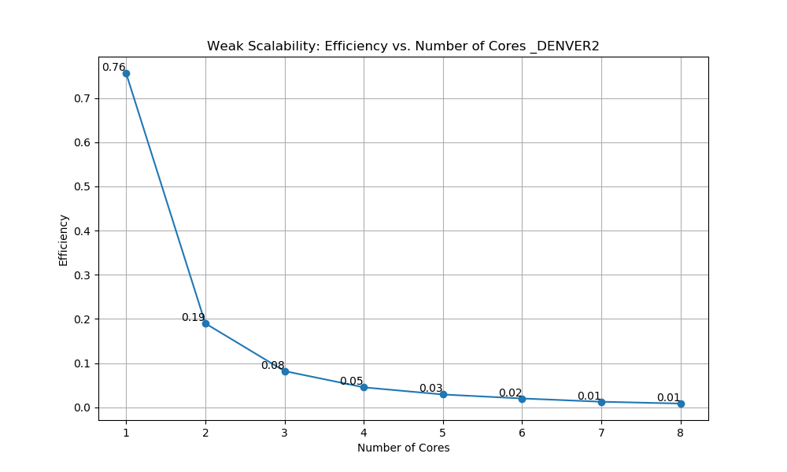

# PROGPAR Project : Move-U-r-Body
Damien ALBISSON Haron DAUVET-DIAKHATE


## Introduction

During the PROGPAR UE, we optimized and accelerated code using various techniques on different hardware. For this end-of-UE project, we will implement a classic of algorithms and simulation, the N-Body Problem (Attraction of celestial bodies to each other). In this document, we propose to describe and analyze different implementations carried out using the various techniques seen in class. We will try to have a critical analysis of how each implementation adapts to this problem. The objective of the paper is to determine which types of optimizations for this kind of problem are qualitatively and quantitatively interesting and what are their differences?

Initially, we will describe each implementation, presenting the techniques used and explaining the choices we made to improve the efficiency of the code.

Then, we will discuss the architecture of the machine on which we are testing these implementations, namely the Nvidia Jetson TX2. The Jetson TX2 integrates an ARM64 Dual-Core Denver 2 and a Quad-Core ARM A57, as well as a Pascal-based GPU with 256 CUDA cores. This combination of processors and GPU offers a unique platform for evaluating the performance and efficiency of different algorithmic implementations in handling the N-Body problem.

Finally, using scripts, we will be able to conduct a comparative study of the implementations against each other during simulations. These experiments will then help us conclude on which implementations are the most quantitatively and qualitatively interesting.


## Description of the Optimizations

Let's first briefly explain the structure of the MUrB program. We have the `SimulationNBodyInterface` class which represents the simulation. For each implementation to be carried out, this class must be implemented, containing the virtual method `computeBodiesAcceleration()`. The purpose of this method is to calculate only the acceleration vector for the current iteration of the simulation.
`Bodies` is the class that represents all the bodies of a simulation and uses two approaches to store the characteristics of each body: the first approach is a list structure, and the second is a structure of lists.
These two approaches will be used to optimize certain implementations.


### Naive

The Naive implementation is the one that follows Newton's law of universal gravitation, which is to say that each body exerts a force proportional to the product of the masses and inversely proportional to the square of the distance to each other object.
$$
\vec{F}_{ij} = G \frac{m_i m_j}{|\vec{r}_{ij}|^2} \hat{r}_{ij}
$$
In this code, we transition from a vector domain to a scalar domain, leading to simplifications in the equation. Additionally, a soft factor is added to avoid digital instability.
$$
\vec{F}_i(t) \approx G \cdot m_i \cdot \sum_{j=1}^{n} \frac{m_j \cdot \vec{r}_{ij}}{\left( \left\lVert \vec{r}_{ij} \right\rVert^2 + \epsilon^2 \right)^{\frac{3}{2}}}
$$
We remind that in this method, it is sufficient to just calculate the acceleration vector, as the time integration is done in another method.

$$
\vec{a}_i(t) \approx G \cdot \sum_{j=0}^{n} \frac{m_j \cdot \vec{r}_{ij}}{\left( \left\lVert \vec{r}_{ij} \right\rVert^2 + \epsilon^2 \right)^{\frac{3}{2}}}
$$

We begin by iterating over the pairs of each object:

```C++
for (unsigned long iBody = 0; iBody < this->getBodies().getN(); iBody++) {
        for (unsigned long jBody = 0; jBody < this->getBodies().getN(); jBody++) {
```

Next, we calculate the distances between these two objects:

```C++
const float rijx = d[jBody].qx - d[iBody].qx;
...
```

The calculation of the acceleration between the two objects is as follows:

```C++
const float rijSquared = std::pow(rijx, 2) + std::pow(rijy, 2) + std::pow(rijz, 2);
const float softSquared = std::pow(this->soft, 2);
const float ai = this->G * d[jBody].m / std::pow(rijSquared + softSquared, 3.f / 2.f);
```

Finally, we add to the acceleration vector the resulting acceleration from the attraction between the two objects.

```C++
this->accelerations[iBody].ax += ai * rijx;
...
```

As you can see, although the code is not very complex, it exhibits quadratic complexity $O(n²)$. This means that as the number of objects in the simulation increases, the number of calculations increases quadratically. This rise is due to the iteration over pairs using nested loops, which is a major challenge in terms of optimization.

This implementation will serve as a reference to verify the accuracy of calculations performed by other methods.

### Sequential

Firstly, we propose an optimized version of the base code. The algorithm presented will therefore serve as a benchmark for future implementations.

The first notable optimization involves removing all calculations associated with constant values of the simulation from the main loop. By placing these calculations in the constructor and initializing them at the start of the simulation, we avoid recalculating them in each iteration. This applies, for example, to the softening factor and the gravitational interaction rate $m*G$, which is now maintained in a vector for each body.

```C++
// in SimulationNBodyxxx.hpp
float softSquared;
std::vector<float> mG;
```
```C++
//in SimulationNBodyxxx.cpp
SimulationNBodyOptim::SimulationNBodyOptim(const unsigned long nBodies, const std::string &scheme, const float soft,
                                           const unsigned long randInit)
    : SimulationNBodyInterface(nBodies, scheme, soft, randInit)
{
    ...
    softSquared = this->soft * this->soft;
    mG.resize(this->getBodies().getN());
}

void SimulationNBodyOptim::initIteration()
{
    const std::vector<dataAoS_t<float>> &d = this->getBodies().getDataAoS();
    for (unsigned long iBody = 0; iBody < this->getBodies().getN(); iBody++) {
        ...

        mG[iBody] = this->G * d[iBody].m;
    }
}
```

Then, the goal was to break the complexity of the nested loops. There are several methods for this, such as linearization of nested loops or loop unrolling. In this algorithm, we chose to simplify redundant calculations. Indeed, the naive algorithm traverses pairs of bodies, but the same pairs are traversed several times. Therefore, we move from a rectangular loop to a triangular loop:

```C++
 for (unsigned long iBody = 0; iBody < this->getBodies().getN(); iBody++) {
    ...
    for (unsigned long jBody = iBody; jBody < this->getBodies().getN(); jBody++) {
```

However, this approach also requires modifying the logic of the loop. Indeed, while all pairs are explored (from i to j), the reciprocal acceleration (from j to i) must also be calculated. According to Newton's third law, within the loop body, we already have all the necessary variables to compute ai2, the attraction experienced by j due to i, and directly store it in the acceleration vector:

```C++
ai = mG[jBody] / powR;                    
ai2 = imG / powR; 
            // ai2 = m * powR;
this->accelerations[iBody].ax += ai * rijx;
this->accelerations[iBody].ay += ai * rijy;
this->accelerations[iBody].az += ai * rijz;

this->accelerations[jBody].ax += ai2 * (rijx);
this->accelerations[jBody].ay += ai2 * (rijy);
this->accelerations[jBody].az += ai2 * (rijz);
```

Although accessing class attributes and vector elements is slower than accessing the value of a typed variable, the gain is negligible compared to the complexity of the code, which is reduced to $O(n²/2)$ (still quadratic). It is, however, important to note that certain indices benefit from temporal locality, and as vectors have their elements contiguous in memory, they also benefit from spatial locality (within the limits of the cache size, of course).

Moreover, to benefit from the rapid access of certain variables often used by the outer loop, we store them in typed variables so that the compiler can (if possible) place them in registers (although this optimization is negligible):

```C++
float x, y, z, rijx, rijy, rijz, rijSquared, powR, ai, ai2, imG;

    for (unsigned long iBody = 0; iBody < this->getBodies().getN(); iBody++) {

        x = d[iBody].qx;
        y = d[iBody].qy;
        z = d[iBody].qz;
        imG = -mG[iBody];
```

Finally, to limit the number of costly calculations, we group calculations into intermediate variables. Considering that our compilation does not include the 'ffast-math' option, direct multiplication is utilized as it is faster than using the pow function, thereby optimizing performance:

```C++
rijSquared = rijx * rijx + rijy * rijy + rijz * rijz; 

powR = rijSquared + softSquared;
powR *= std::sqrt(powR);
```

The performance gain is significant compared to the naive version. The objective here was to find a compromise between the reusability of the code, its speed, and the overall memory consumption. While the algorithm remains very simple, going further would require significant rearrangement compared to the original code or a new compromise on precision. Moreover, by adding an additional vector in memory, it appears that sometimes optimizing the speed of an algorithm comes at the expense of increased memory usage.

For example, we could have used the famous Fast Inverse Square Root algorithm to normalize vectors, or implemented the Barnes–Hut algorithm, which is based on octrees to approximate the simulation in groups of bodies.

### Multi-threading

For the multithreaded part, as seen in the course, we used OpenMP. OpenMP (Open Multi-Processing) is an API used for developing parallel programs in C, C++, and Fortran. It is a widely adopted standard for parallel programming on shared memory architectures. OpenMP is a well-documented standard and, most importantly, it has an extremely simple and intuitive implementation. It took us very little time to implement it, but we still encountered some unexpected problems. Indeed, when we parallelized the triangular loop on our personal machines, the algorithm seemed faster than its rectangular, parallelized counterpart. However, on the Jetson architecture, this was not the case; it was even slower. Therefore, we chose to keep the parallelized rectangular loop, but we will explain both algorithms, which are not so different.

<!-- Le problème qui surviennent lorsqu'on souhaite paralléliser cette algorithmle est qu'il y a une concurrance pour écrire  -->


#### Rectangular

As in the naive version, the rectangular loop executes twice as many calculations which are already computed. We could have stored them in vectors and added a condition to check for the calculation's existence in the vector, but for performance optimization, it was out of the question to add branching in our loops.

To parallelize these loops, we added the following clauses:
```C++
#pragma omp parallel firstprivate(sumAx,sumAy,sumAz)
    {
        #pragma omp for schedule(runtime) nowait
        for (unsigned long iBody = 0; iBody < this->getBodies().getN(); iBody++) {
```
From the `omp parallel` block, several threads execute the code. Then, with `omp for schedule(runtime) nowait`, the threads distribute the execution of the loop without waiting for its completion. The way OpenMP distributes the executions depends on parameters provided at runtime: **OMP_NUM_THREADS** for the number of cores (threads) used and **OMP_SCHEDULE** to choose the distribution strategy profile and the chunk size (how many indices a thread executes before restarting).

To speed up the rectangular loop, we came up with the idea of using an accumulator to store all the acceleration sums of objects j for an object i. This effectively limits memory access. These variables are private for each thread, hence the `firstprivate(sumAx, sumAy, sumAz)`:

```C++
float sumAx = 0.f;
float sumAy = 0.f;
float sumAz = 0.f;

#pragma omp parallel firstprivate(sumAx,sumAy,sumAz)
{
    #pragma omp for schedule(runtime) nowait
    for (unsigned long iBody = 0; iBody < this->getBodies().getN(); iBody++) {
        for (unsigned long jBody = 0; jBody < this->getBodies().getN(); jBody++) {
            ...

            sumAx = 0.f;
            sumAy = 0.f;
            sumAz = 0.f;

            ...

            sumAx += ai * rijx; 
            sumAy += ai * rijy; 
            sumAz += ai * rijz; 
        }
        this->accelerations[iBody].ax += sumAx;
        this->accelerations[iBody].ay += sumAy;
        this->accelerations[iBody].az += sumAz;
    }
}
```

Best practices in parallelization generally recommend parallelizing the outer loop, which should also be the one with the fewest iterations.

#### Triangular

It is true that parallelizing a triangular loop is somewhat more complicated and requires more memory resources:

```C++
std::vector<std::vector<float>> thread_i_accelerationX;
std::vector<std::vector<float>> thread_i_accelerationY;
std::vector<std::vector<float>> thread_i_accelerationZ;

#pragma omp parallel
{
    int thread_id = omp_get_thread_num();

    #pragma omp single
    {
        int thread_NUMBER = omp_get_num_threads();

        thread_i_accelerationX.resize(thread_NUMBER, std::vector<float>(this->getBodies().getN(), 0.0f));
        thread_i_accelerationY.resize(thread_NUMBER, std::vector<float>(this->getBodies().getN(), 0.0f));
        thread_i_accelerationZ.resize(thread_NUMBER, std::vector<float>(this->getBodies().getN(), 0.0f));
    }
```

Indeed, when threads distribute themselves in the outer loop and each executes the inner loop, a concurrency phenomenon is created for accessing the acceleration vectors, compromising the coherence of the calculations. Therefore, it is essential to have accumulators for each thread, which are created and initialized at each iteration by a single thread.

```C++
#pragma omp for schedule(static) nowait
for (unsigned long iBody = 0; iBody < this->getBodies().getN(); iBody++) {

    ...

    for (unsigned long jBody = iBody; jBody < this->getBodies().getN(); jBody++) {
        ...
    thread_i_accelerationX[thread_id][iBody] += ai * rijx; 
    thread_i_accelerationY[thread_id][iBody] += ai * rijy; 
    thread_i_accelerationZ[thread_id][iBody] += ai * rijz; 

    thread_i_accelerationX[thread_id][jBody] += ai2 * (rijx); 
    thread_i_accelerationY[thread_id][jBody] += ai2 * (rijy); 
    thread_i_accelerationZ[thread_id][jBody] += ai2 * (rijz); 

    }
```
At the end of the calculations, it is necessary to empty the accumulators in a critical block, thus sequentially.

```C++
#pragma omp critical
for ( long unsigned int i = 0; i < this->getBodies().getN(); i++ ) {
    this->accelerations[i].ax += thread_i_accelerationX[thread_id][i];
    this->accelerations[i].ay += thread_i_accelerationY[thread_id][i];
    this->accelerations[i].az += thread_i_accelerationZ[thread_id][i];
}
```

It is probably the management of concurrency that slows down the execution. In the previous version, almost 90% of the code was parallelizable, while here we are at about 70% (see Amdahl's Law).

We conducted a series of tests to determine which profile options and chunk sizes for OpenMP were most advantageous. On the Jetson, a dynamic profile with a 16 chunk sizes seems to be the more efficient option.

### SIMD

SIMD (Single Instruction, Multiple Data) is a parallel computing model used in computer architecture. In the SIMD model, a single computation instruction is executed simultaneously on multiple data elements in a single operation cycle, thus improving performance for scientific operations. This model seems perfect for optimizing our problem. To do this, we would need to use the intrinsic functions provided by the processor manufacturer, namely NEON-ARM, but this can be tedious and make our code less portable. Instead, we decided to use the MIPP (My Incredibly Powerful Processor) library, discussed in our course, which offers a simple interface for writing code that can leverage SIMD acceleration without worrying about the underlying architecture's specifics.

Intuitively, given that the size of a SIMD register on the ARM architecture is 128 bits, we can store up to 4 single-precision floats in a register (4 * 32 bits) and therefore perform 4 simultaneous acceleration calculation operations. Here's how we implemented this.

We chose to use array structures rather than structures of arrays, contrary to previous optimizations. This way, we can directly load the data associated with "iBody" into a vector register:

```C++
const dataSoA_t<float> &d = this->getBodies().getDataSoA();
```

In our parallelization approach, we decided to use vector registers only for "iBody" data and not for "jBody". This decision is based on the observation that, although each "iBody" must interact with each "jBody", loading "jBody" into vector registers would make the process as complex as sequential computing. Indeed, it would require processing each "jBody" in the vector register for each "iBody", thus nullifying the benefits of parallelism. To maintain the efficiency and simplicity of our algorithm, we therefore chose not to use vector registers for "jBody", while using them for "iBody". This approach explains our choice of a rectangular loop rather than a triangular one, unlike previous optimizations. Using a rectangular loop allows us to manage the interactions between "iBody" and "jBody" more effectively, without the additional complexities associated with vector register parallelism for "jBody":

```C++
for (iBody = 0; (iBody + mipp::N<float>()) < this->getBodies().getN(); iBody += mipp::N<float>()) {
    rrijxIbody.load(&d.qx[iBody]);
    rrijyIbody.load(&d.qy[iBody]);
    rrijzIbody.load(&d.qz[iBody]);

    ...

    for (unsigned long jBody = 0; jBody < this->getBodies().getN(); jBody++) {
```

Similarly to the multithreaded implementation, we use vector accumulators to store the acceleration sums. This way, we limit the register storage operations in the acceleration vectors:

```C++
std::vector<float> vsumx(this->getBodies().getN());
std::vector<float> vsumy(this->getBodies().getN());
std::vector<float> vsumz(this->getBodies().getN());

...

        sumx += raccx;
        sumy += raccy;
        sumz += raccz;
        }//for jBody

    sumx.store(&this->accelerations.ax[iBody]);
    sumy.store(&this->accelerations.ay[iBody]);
    sumz.store(&this->accelerations.az[iBody]);
}//for iBody
```

When possible, we used the same mathematical simplifications as before. We even took advantage of the fused multiplication and addition operation (linear application) to calculate the squared distance between the objects:

```C++
rrijSquared = mipp::fmadd(rrijx, rrijx, mipp::fmadd(rrijy, rrijy, mipp::fmadd(rrijz, rrijz, mipp::Reg<float>(softSquared))));
```

Obviously, since the bodies are processed in batches of 4 and the total number of bodies is not necessarily a multiple of 4, the remaining few bodies need to be processed. For this, the sequential algorithm is executed at the end of the iteration.

### GPU

The GPU is a remarkable hardware that, instead of performing calculations sequentially or by vector (as in the case of SIMD), executes them by matrices. For this, we use OpenCL (Open Computing Language), an API that allows writing programs that can run on a variety of computing devices, especially GPUs. OpenCL provides a C-based language for programming these work units, called "kernels", which are executed on initialized devices.

This implementation therefore adds quite a few initialization functions that we will not detail here. We will rather focus on the kernel code and how we prepared the data to be sent to the kernel.

During the initialization, we retrieve data in array structures to be able to store each attribute of each body in vectors, which we will send to our GPU's buffer:

```C++
// in initIteration()
const dataSoA_t<float> d = this->getBodies().getDataSoA();

const std::vector<float> vqx = d.qx;
const std::vector<float> vqy = d.qy;
const std::vector<float> vqz = d.qz;
const std::vector<float> vm = d.m;
```

The total size of the calculations to be performed (`GPU_global_size`) is equal to the number of bodies present in the simulation. It is simpler to use the "rectangular" logic of the GPU, half of the calculations will be redundant. Therefore, we send to the kernel:

```C++
// in computeBodiesAcceleration()
size_t global_size[2] = {GPU_global_size, GPU_global_size}; 
size_t local_size[2] = {1, 1};
```

In the OpenCL configuration, the global size (`global_size`) determines the total number of work-items to be executed, while the local size (`local_size`) specifies the dimension of each workgroup. Each group, composed of work-items, is executed on a single GPU core and can share data via local memory. Currently, `local_size` is set to `{1, 1}`, meaning each group contains only a single work-item. This may be inefficient as it does not fully exploit the parallelism of workgroups on the GPU. The optimal size of `local_size` varies depending on the nature of the computation and the GPU's cache memory capacity. It is advised that the global size be a multiple of the local size to prevent inactivity of some work-items and ensure complete execution of computations. Although the current performance is satisfactory, adjusting `local_size` could provide an additional avenue for optimization, though it requires dedicated profiling and different management of workgroups.

The kernel couldn't be simpler: we retrieve object i and object j and perform the optimized calculation seen previously:

```C++
int x = get_global_id(0);
int y = get_global_id(1);

const float rijx = qx[y] - qx[x];
const float rijy = qy[y] - qy[x];
const float rijz = qz[y] - qz[x];

const float rijSquared = rijx * rijx + rijy * rijy + rijz * rijz;

float powR = rijSquared + softSquared;
powR *= sqrt(powR);

const float ai = G * m[y] / powR;

ax[x] += ai * rijx;
ay[x] += ai * rijy;
az[x] += ai * rijz;
```

However, optimizing the logic of this implementation can quickly become complicated and encounter problems with thread synchronization, memory inconsistency, or simply increased complexity. Since the executions are not interdependent, we found it wise to stick with a simple implementation.

### Heterogeneous

The heterogeneous version leverages our two best implementations, namely OpenMP and OpenCL, to distribute the workload. Thus, we introduce a macro `BALANCE_GPU_CPU` which is the balancing factor between the GPU version and the parallelized CPU version. They will execute simultaneously, but not on the same data set. After profiling, we estimated that a ratio of 1:2 (1/3 for GPU and 2/3 for CPU) provides a good balance.

```C++
//in constructor
GPU_CPU_balance = GPU_global_size / BALANCE_GPU_CPU;

//in computeBodiesAcceleration()
size_t global_size[2] = {GPU_CPU_balance, GPU_global_size};
...

#pragma omp parallel firstprivate(sumAx,sumAy,sumAz)
    {
        #pragma omp for schedule(runtime)
        for (unsigned long iBody = GPU_CPU_balance; iBody < this->getBodies().getN(); iBody++) {

```

The CL kernel and the parallelized code remain exactly the same as before.

## Computer Architecture

The Jetson TX2 is a showcase of NVIDIA's technology. Let's see what it offers on paper and formulate some hypotheses regarding our optimization.

### Jetson TX2 Overview

The Jetson TX2 is a System on Module (SoM) that's part of the Jetson range, dedicated to edge computing for artificial intelligence.

It integrates an ARM64 Dual-Core Denver 2 processor, designed to natively run ARMv8 code. In fact, ARM code is either translated by a hardware translator or through software emulation into an internal instruction set within the Denver Project. This allows for dynamic code optimization and execution from the cache. This processor is a 7-wide in-order superscalar with a 2-way decoder, 2 cores, and operates at a frequency of 2 GHz. It can perform 8 floating-point operations in single precision or 4 in double precision per cycle.

The Quad-Core ARM A57, with an ARMv8-A 64-bit instruction set, works with an out-of-order superscalar pipeline that can reorder instructions in the pipeline. It has a 3-way decoder and is an 8-wide super-scalar with 4 cores. This processor can also perform 4 floating-point operations in single precision or 2 in double precision per cycle.

The TX2 also includes NEON SIMD extensions and a Pascal GPU with 256 CUDA cores.

It comes with 8GB of memory with a bandwidth of 60GB/s and a low energy consumption (TDP) of 7.5W to 15W.

Let's explore some metrics to better interpret the results of our experiments.

### Processor Peak Performance

Processor Peak Performance indicates the maximum number of floating-point operations that the processor can theoretically execute per second. This measure is generally used to assess the raw computational power of a processor.

The maximum computational capacity of the processor is calculated as follows:

$$
peakPerf = nOpsCore * freq * nCores
$$

en GFlop/s

Denver (Single precision) = 8∗2∗2 = 32 GFlop/s
Denver (Double precision) = 4∗2∗2 = 16 GFlop/s
Cortex (Single precision) = 4∗2∗4 = 32 GFlop/s
Cortex (Double precision) = 2∗2∗4 = 16 GFlop/s

### Arithmetic Intensity

Arithmetic intensity measures the ratio between computational operations and memory operations. The higher this intensity, the more the code is limited by the computing units. The lower it is, the more the code is limited by memory access.

It is calculated as follows:

$$
AI = nOperations/nMemoryOperations
$$

Let's calculate the arithmetic intensity of our two implementations:

For the naive code $O(n²)$

* 3 calls to std::pow (considered as 3 operations) for rijSquared.
* 3 subtractions for rijx, rijy, rijz.
* 1 addition for rijSquared.
* 1 call to std::pow for softSquared (considered as 1 operation).
* 1 addition for rijSquared + softSquared.
* 1 call to std::pow for (rijSquared + softSquared)^(3/2) (considered as 1 operation).
* 1 multiplication for this->G \* d\[jBody\].m.
* 1 division to calculate ai.
* 3 multiplications for ai \* rijx, ai \* rijy, ai \* rijz.
* 3 additions for the updates to accelerations.
  
* 6 reads for d\[jBody\].qx, d\[jBody\].qy, d\[jBody\].qz, d\[iBody\].qx, d\[iBody\].qy, d\[iBody\].qz.
* 1 read for d\[jBody\].m.
* 3 reads for the existing values of accelerations.
* 3 writes for the updates of accelerations.

AI = 1.31

For the optimized code $O(n²/2)$

* 3 subtractions for rijx, rijy, rijz.
* 3 multiplications for rijx \* rijx, rijy \* rijy, rijz \* rijz.
* 2 additions to calculate rijSquared.
* 1 addition for rijSquared + softSquared.
* 1 multiplication for powR \*= std::sqrt(powR).
* 1 division for ai = mG\[jBody\] / powR.
* 1 division for ai2 = imG / powR.
* 3 multiplications for each += on the components of accelerations.
* 3 additions for each += on the components of accelerations.
  
* 3 reads for d\[jBody\].qx, d\[jBody\].qy, d\[jBody\].qz.
* 1 read for mG\[jBody\].
* 3 reads for the existing values of accelerations.
* 3 writes for the updates of accelerations.

AI = 1.7

### Operational Intensity

Unlike arithmetic intensity, operational intensity takes into account the size of the data in memory. A program with high operational intensity is generally limited by computing power, while a program with low operational intensity is limited by memory bandwidth.

$$
OI = AI/DataSize
$$

In our codes, all values involved in the calculations are floats, thus 4 bytes:

naive OI = 0.3275
optim OI = 0.425

### Roofline

The Roofline model limits the maximum achievable performance by taking into account the memory bandwidth (RAM) and the peak performance of the processor. Depending on the operational intensity, the code is limited either by memory bandwidth or by the peak performance of the processor.

$$
Attainable op/s = min(peakPerf,MemoryBW * OI)
$$

naive Op/s excepted = 19.65 GFlop/s
optim Op/s excepted = 25.5 GFlop/s

Of course, on an OS, performance can have contention because other programs are running, and we do not take into account the Cache, which greatly accelerates memory access.

In summary, the Denver and Cortex processors should have the same capacity. It remains to be seen if there is a significant difference in how they optimize code. For the GPU with 256 CUDA cores, we probably have the same type of performance as the processors in terms of Gigaflops without te lack of bandwith. In terms of optimizations, the naive code performs more memory accesses and arithmetic operations than the optimized (sequential) code. Theoretically, there should be a 1.3 gain in performance, not counting the complexity divided by 2 (which is only valid for a reasonable number of bodies) otherwise, the gain is 2.6. In terme of core Denver should be better in parallelism than Cortex and in SIMD we excepted the same performance.

Let's verify these hypotheses with several experiments.

## Experimentation Results

To successfully conduct our experiments, we wrote a program that performs various profiling to analyze multiple metrics. This includes studying FPS, GFlops, memory, and various usage metrics related to the study of parallelism in our program. This is applied to both processors of the Jetson. We will also discuss the challenges encountered and talk about the quality of our code.

### General Comparison

First, a brief overview of the average performance (in FPS) achieved during the benchmark execution:


>Note that all performances of the parallelized versions, where the number of used cores is not indicated, are executed with 8 threads, a dynamic profile, and a chunk size of 16.

The difference between the two processors is not significant. The Cortex A57 appears to be more performant on the majority of implementations. The winning optimization is the heterogeneous version (parallel/G

PU), closely followed by the parallelized version using OpenMP, which is to be expected. The GPU version delivers decent performance for real-time rendering. Paradoxically, the SIMD version is the slowest, which can be disappointing given the complexity of the code is high. On our personal machines, the SIMD version was one of the best implementations, with a very significant performance gain over the naive version (approximately 50 to 100 times faster).

Regarding the performance gain between the naive and optimized sequential versions, we observe a ratio very close to the previously calculated theoretical value of 2.6.

Let's now analyze the performance evolution based on the number of bodies in the simulation:

#### FPS per Bodies


As expected, the performance decreases quadratically with the number of bodies. As we approach a large number of bodies, the naïve, optim, and SIMD versions show performances close to zero and constant. For the GPU version, the performance is very low for a small number of bodies, then there is a performance spike around 600 bodies. This can be explained by the size of the workgroup and the hardware capacity of the GPU which is not fully utilized, making it more costly to manage a few objects relative to the cost of initialization. We expected the same finding for the parallelized version since there is a cost to thread management. However, that is not what we observe; instead, the opposite occurs. The heterogeneous version begins to outperform the parallelized version in terms of performance around 800 objects, which is most likely related to the GPU's performance peak.

#### Memory per Bodies

We chose not to print the results regarding memory consumption by the different implementations, as this metric is heavily influenced by the size of the data structures allocated to store the bodies. This size increases quadratically (we have about 1 MB for 1000 bodies). The size of the allocated arrays and registers is negligible compared to this value. One could say that the OpenCL version consumes the most memory, but since it is moved to video memory, access is very fast.

#### GFlops per Bodies


A good memory operation frequency increases with the number of calculations to be performed until it reaches a ceiling, which is observed here. Although we are far from the theoretical calculations expected, this was anticipated. A stable frequency is also distinguished by a consistent trend with few fluctuations. Fluctuations indicate uneven load and management by third-party APIs and libraries handling threads. These fluctuations are noted in the parallelized (OpenMP), GPU (OpenCL), and naturally, in the heterogeneous versions. The latter reaches its computational performance ceiling with a large number of objects, which demonstrates good hardware utilization, despite significant fluctuations.

### Parallel Performances

Given that the parallelized versions (OpenMP and Heterogeneous) are the most efficient, it is useful to conduct a specific case study on the evolution of performance from a functional perspective. Here, we only studied the simple parallelized version without GPU, using the optimized sequential version as a reference.

#### Visualization of the Execution Time


> Note that these results are based on an average of 3000 objects for 100 iterations.

Intuitively, multiplying the number of cores should divide the execution time. This trend is confirmed in our analysis, where we also observe that beyond 6 threads, the performance no longer improves significantly. This occurs when the overhead of thread management becomes too great. There could also be a saturation of the memory bus. This bottleneck is reached when the computational load for each thread offsets the benefits of rapid memory access and the cache becomes saturated.

#### Speedup

In parallel computing, speedup is often used to quantify the efficiency of an algorithm executed on multiple processors or cores compared to a single one, thus
indicating the effective acceleration of our code. Speedup is calculated as the ratio of the time it takes to execute a task on the reference system (optimized version on a single processor) to the time on a parallel system.

$$
S = D_s/D_c
$$


Theoretically, the speedup for one core should be 1. However, this is not the case here, simply because the optimized sequential version is faster than the naive parallelized version due to different complexities. This shortfall is offset by the acceleration gained when increasing the number of cores.

Ideally, a good speedup should increase linearly with the number of threads used. As previously observed, there is no further acceleration from 6 cores onwards, and there is a good reason for that.


#### Amdahl’s Law

Amdahl's Law predicts the maximum theoretical improvement in the performance of a computer system when a part of it is accelerated. The maximum execution speed achievable by increasing the number of processors is limited by the portion of the program that must still be executed sequentially. Indeed, not everything can be parallelized in code (as seen in the parallelized code with our two mentioned versions).

$$
Smax = 1/(1-fD_p)
$$

Where $fD_p$ is the percentage of code that can be parallelized. Indeed, compared to the optimized sequential version (although it has a slightly lower complexity), we have an Smax​ of 4.5 (more than 70% of the code is parallelizable).

This is not the only law formulated to study maximum acceleration; there are much more complex models that take into account the growth in data size, such as Gustafson-Barsis Law.

#### Efficiency

Efficiency measures the rate of optimal performance that is not lost when increasing the number of cores. It allows understanding the real impact of parallelization on performance and also helps identify bottlenecks.

$$
E = D_c/(D_s * C)
$$


> Note that these results are based on an average of 3000 objects for 100 iterations.

An efficiency lower than 1 indicates that the parallel system is not entirely efficient. The closer the efficiency is to zero, the less effective the system is. An efficiency of 1 (or 100%) would mean that the parallel system is perfectly efficient, which is rarely the case in practice. Depending on the number of resources in the simulation, efficiency spikes when reaching the number of cores of the used system, which is an observation related to weak scalability.

#### Strong/Weak Scalability

The scalability of a code measures its ability to remain efficient as the number of cores increases. Strong scalability measures the acceleration of the program when the size of the problem remains constant, in this case, the number of cores, which corresponds to the SpeedUp. If the speedup is slightly sub-linear, it's because concurrent access creates a bottleneck; indeed, threads must synchronize at the end of each iteration, leading to efficiency loss.

It is useful to visualize if acceleration remains effective when increasing the number of resources. Ideally, performance should stay the same if the problem size increases proportionally to the number of cores, which weak scalability measures :

$$
E_s = D_s / (D_c(n * C ressources) * C)
$$



> Note that for 1 core, we had 3000 resources, for 2 cores, 6000 resources, and so on...

This metric should be constant; here, it is not, likely due to bandwidth saturation: the number of calculations scales quadratically with the number of objects in the simulation.

Ultimately, we observe significant losses due to the complexity of the algorithm. Even though acceleration is observed, the material limitations lead our efficiency quickly towards a bottleneck.

### Quantitative Comparison

Quantitative comparison refers to the actual performance differences and the conclusions that can be drawn from them.

#### naive vs SIMD

These are the two slowest implementations. Although SIMD is slightly better than naive, we do not fully understand why the performance is so low on this architecture, likely because redundant calculations are not avoided, as was the approach taken. It is clear that having the intuition to write optimized SIMD code is quite complex and requires a lot of upfront profiling.

#### CPU vs GPU

It is not straightforward to know on which hardware the code will be fastest and most optimized. Regardless, the use of threads, whether they are threads of physical processor cores or CUDA cores, significantly speeds up the code. This is why a hybrid version is very relevant for this type of application, as we have observed.

### Qualitative Comparison

A personal perspective on the implementation can be useful to judge the quality of an optimization.

#### Number of data structs used

The optimized sequential version does not significantly increase the number of instantiated types and data structures, and the same goes for the parallelized version. For the SIMD implementation, it can be tricky to handle an increased number of vector registers and to understand how data is loaded into a register and unloaded into a vector. For the GPU versions, the instantiated structures are numerous, but in most cases, this is transparent in our code. We chose not to multiply the data used in our code because memory access can be complex to manage when several are accessed simultaneously, and this is also a significant factor in slowdown due to the need to consider whether the data is on the stack or the heap, if it is in the cache and if it does not produce a miss.

#### Codes complexities

With some mathematical knowledge, it is not complicated to understand the simplifications made. Acquiring knowledge of the OpenMP API is not very time-consuming, but its implementation can be hair-pulling when it comes to synchronizing threads and achieving good acceleration. In fact, when all these implementations were realized, there were many optimized versions that seemed good on paper but were completely ineffective in practice, which greatly influences motivation and sometimes forces one to stick to simple but effective versions.

Understanding the logic of SIMD registers with MIPP can be a bit confusing, and using intrinsics could have been even worse. For OpenCL, the initialization is long to learn, as is dealing with the workgroups, plus we need three source files for this implementation.

#### Understability Relaibility

The code's portability is not assured for MIPP and OpenCL because it heavily depends on the architecture used. For instance, on one of our personal machines, the SIMD version worked well, but certain operations, particularly on Intel processors, caused precision losses that made the tests fail. For most implementations, if one wishes to improve the code, it would probably require a completely new approach and significant code changes, even adding methods and attributes to the Simulation interface.

To conclude, the optimized version, although poor in gains, was the most fun to work on, trying to scrape every last FPS. With the OpenMP and OpenCL versions, it was easy to get lost in unnecessary and headache-inducing optimizations, but it was interesting to do profiling using our script to evaluate performance. The SIMD version was a nightmare to optimize, and the results were quite disappointing.

## Conclusion

All this work was not in vain; we learned a lot while carrying out this project. The further we progressed in the hierarchy of optimizations, the more time we saved. Moreover, the process was retroactive. For example, we found the mathematical simplification with the root when we realized there was no power operation for SIMD.

Speaking of roots:

>“The real problem is that programmers have spent far too much time worrying about efficiency in the wrong places and at the wrong times; premature optimization is the root of all evil (or at least most of it) in programming.” Donald Knuth, The Art of Computer Programming

Finding information about the SoM used in this course was as complicated as understanding why some implementations worked or did not work. The mystery of the Jetson also lay in the fact that, in practice, some hypotheses were completely invalidated.

The profiling work was lengthy but enriching. Although the Jetson does not consume much energy, we ran so many simulations to find the optimal parameters that EDF is probably questioning the legality of our actions. Joking aside, we were first able to determine which optimization was the most effective. Combining scientific and personal approaches was crucial in addressing our problem. The balance tilts towards the undecided: the heterogeneous version, the perfect alliance between the computational capacity of a GPU and the use of processor threads. Implementing OpenCL is not difficult as long as we do not delve into complicated optimizations in the kernel, and OpenMP has become a standard; we could not overlook it. This work also taught us good and bad programming practices in various contexts.

The implementation of the project required a strict view of calculation precision. In practice, it is also interesting to find algorithms and approximation methods without neglecting the accuracy of the results. This also depends on the application field. For example, if one wants to create a pseudo-playful simulation, it would be interesting to calculate only stable orbits. If we want to add other physical properties like collisions, we will need to find a compromise between memory usage and calculation frequency. We refer to Space Engine and Universe Sandbox, which are excellent examples of playful pseudo-simulation software offering interesting and debatable realism.